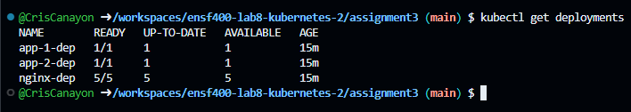

# Assignment 3 - Kubernetes

## Deployment Setup
Run the following commands to initialize and deploy all files:
```bash
cd /workspaces/ensf400-lab8-kubernetes-2/assignment3
minikube start
minikube addons enable ingress
kubectl apply -f '*.yaml'
```
> **Note:** the line `kubectl apply -f '*.yaml'` allows you to run all yaml files simultaneously

Your output should look something like this:


## Running Curl Commands
Run the following command to test the curl responses:
```bash
curl http://$(minikube ip)/
```

Running it several times should get you an output that resembles something like this:

As you can see, there is a 7-3 split favouring app 1, which is to be expected due to app 2 being a canary deployment with a weight of 30%.

## Additional Commands
The following commands can be used to get additional information:
```bash
kubectl get pods -o wide
```


```bash
kubectl get deployments
```


```bash
kubectl get ingresses
```
